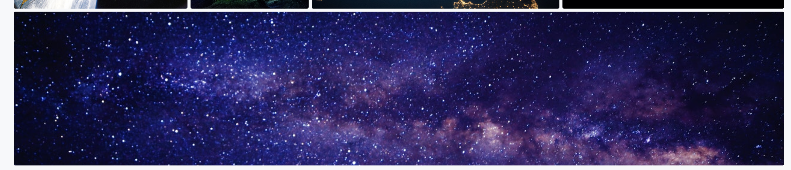
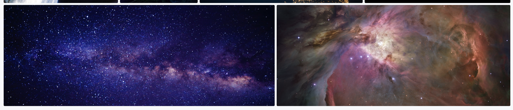

# README

[Live Demo](https://cosmicsnaps.herokuapp.com/)

CosmicSnaps is an image hosting site inspired by 500px. A place where astronauts can share their cosmic related captures.

I designed and built this project within a two-week timeframe.

This is project utilizes React.js and Redux on the front end, Rails and PostgreSQL on the backend.
I plan to refactor my code, and keep on adding improvements in the future.

## Features
* Implemented a secure User authentication system using BCrypt
* Able to host pictures using AWS active storage
* Users have their own profile page, and pictures that they uploaded are shown
* Home feed displays all users pictures
* Pictures can be uploaded, edited, and deleted by their authors
* Can click on CosmicSnaps in navigation bar to be redirected to home feed

### Picture Interactions
Users can see other Users pictures on the home feed, including their own. If they see their own picture on the home feed they can edit the picture or delete it.

Each user has a profile Page that contains all the pictures of each user.


I started of with a grid, but then my images would be scaled incorrectly with my attempts. Then I stumbled upon display: flex, and using flex-wrap: wrap.

```html
<div className="content">
  <div className="profile-header-with-cover">
    <div className="cover-wrap">
      
    </div>
    <div className="user-details">
      <h1>{this.props.username}</h1>
    </div>
  </div>
  <div className="profile-nav-bar">
  </div>
  <div className="profile-body">
    BODYYYYY
    <div className="full-grid-container">
      <div className="grid-container">
```
Before even beginning to start flex wrapping, I took a peek at 500px's profile page and noticed all the divs being used as containers. I then began to understand the purpose of the divs.

```css
.grid-container {
  display: flex;
  flex-wrap: wrap;
}

.grid-container::after {
  flex-grow: 99999999;
}
.img-box {

  margin: 3px;
  position: relative;
  flex-grow: 1;
  height: 305px;
  overflow: hidden;
  border-radius: 3px;

  .user-image {
    min-width: 100%;
    height: 305px;
    object-fit: cover;
    vertical-align: baseline;
```
The important parts were flex-wrap, it helped me specify whether my images can be forced onto a single line, or wrapped onto multiple lines. For example this image of clouds:


Another thing I was able to understand was flex-grow: 99999999. The significance of this was so that images on the bottom of the container would be allowed to grow into the remaining space of the container.

Not only that but if another image were to be added on the bottom of the container, because of flex wrap space will be made.

As seen in the gifs above, images will be scaled  according to the size of their container due to object-fit: cover.

### Versatile Code
```javascript
#UploadPicture container
const mapStateToProps = (state, ownProps) => ({
  picture: {
        title: "",
        description: "",
        photoFile: null,
        photoUrl: null
#EditPicture container
const mapStateToProps = (state, ownProps) => ({
  picture: ownProps.picture,
  userId: state.session.id,
```
When researching and developing ways to create CRUD for the pictures, I noticed that there were ways to keep the code dry. I passed two types of picture objects in these two different containers as a picture variable to UploadForm. I also named createPic as action, and updatePicture as action, so that in the upload form no matter what was being passed in it would run the action with the given picture.

```javascript
#EditPicture container
const mapDispatchToProps = dispatch => ({
  action: (pic, picId) => dispatch(editPicture(pic, picId)),
  requestAllPictures: () => dispatch(requestAllPictures())
});
#UploadPicture container
const mapDispatchToProps = dispatch => ({
  action: (picture) => dispatch(createPic(picture)),
  requestAllPictures: () => dispatch(requestAllPictures())
});
```
After this logic was set, I had to render EditFormContainer, and UploadFormContainer in the right places, and then the functionality of editing and uploading pictures are done!

### Project Design
CosmicSnaps was created with a space theme in mind. A place where Users can share awestricken pictures of outer world attractions. I was focused on a core set of features that were made to be ran bug free.  

### Future Features
* Adding an image overlay allowing for likes, and add to gallery.
* Creating a gallery component for each user to add images to a gallery.
* Create Follows for each User
* Create a more descriptive about body for users to express themselves more.
